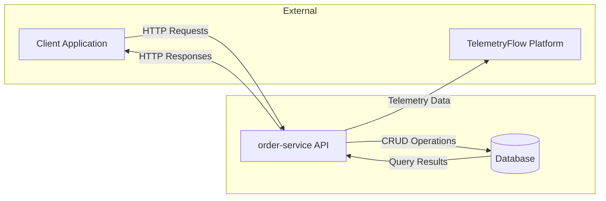
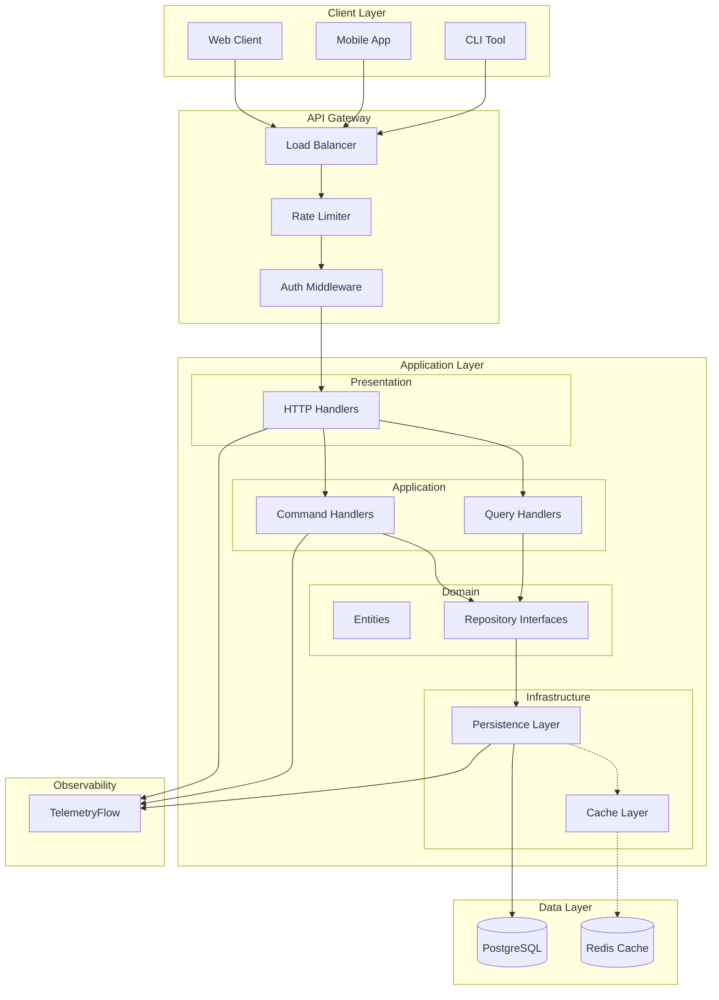
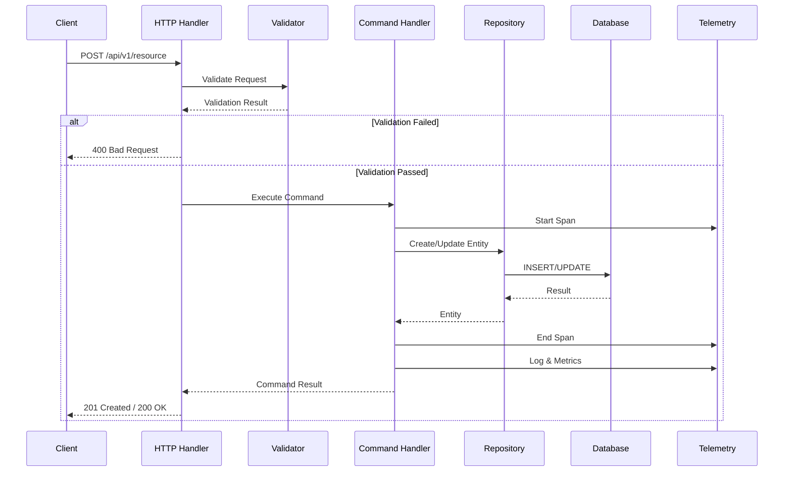
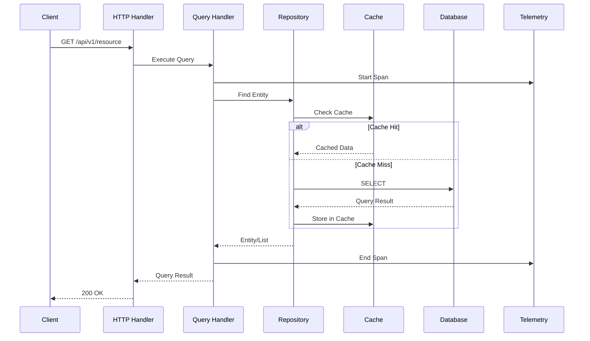
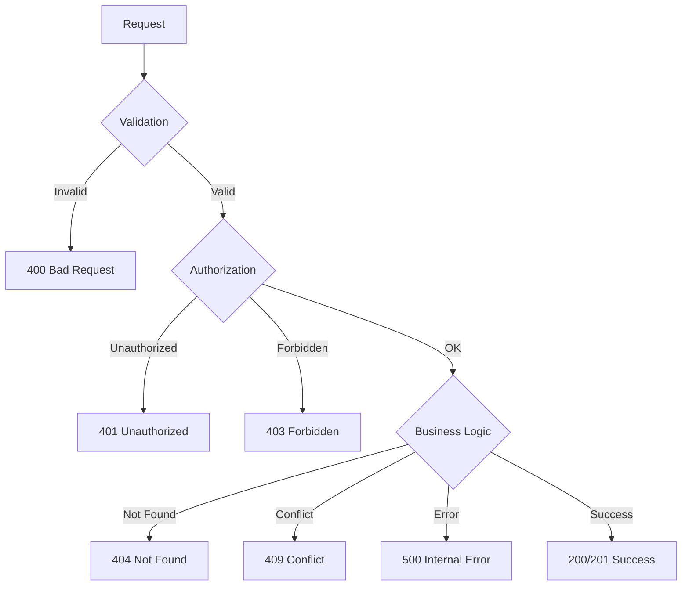

# Data Flow Diagram (DFD)

## order-service

This document describes the data flow for order-api.

## Level 0 - Context Diagram

## Level 1 - System Diagram

## Level 2 - CQRS Flow

### Command Flow (Write Operations)

### Query Flow (Read Operations)

## Data Transformations

| Layer | Input | Output | Transformation |
|-------|-------|--------|----------------|
| HTTP Handler | HTTP Request | DTO | Parse JSON, Validate |
| Command Handler | DTO | Domain Event | Apply Business Rules |
| Repository | Entity | DB Row | Serialize to DB Format |
| Query Handler | Query Params | DTO | Projection, Filtering |

## Error Handling Flow

## Notes

1. All requests go through rate limiting
2. Commands modify state, Queries are read-only (CQRS)
3. Cache is checked before database on read operations
4. Telemetry captures metrics, logs, and traces at each layer
